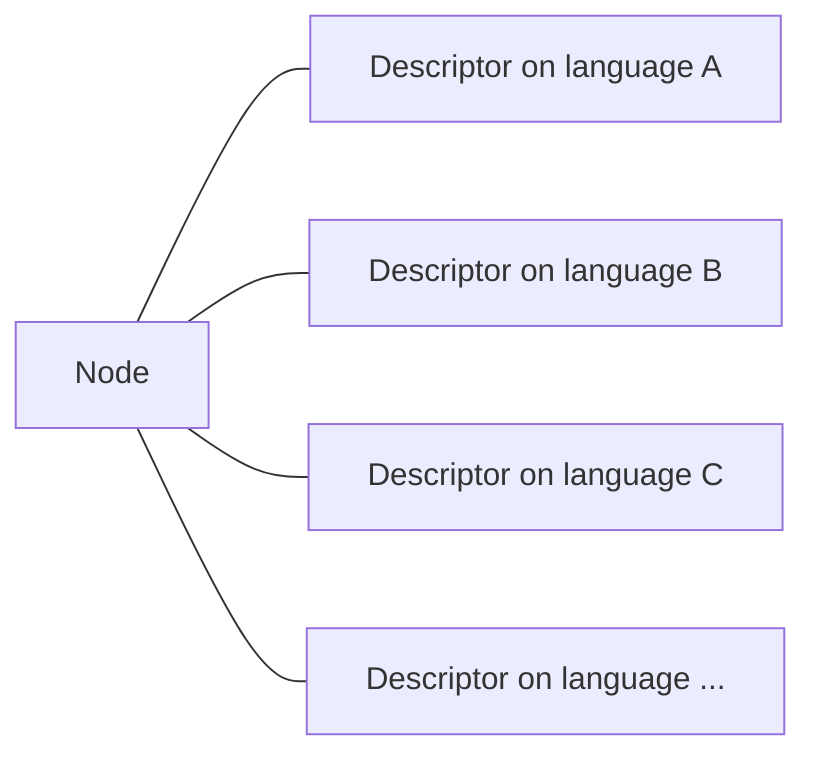
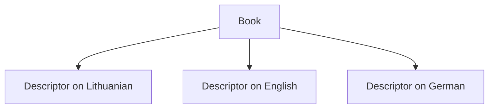
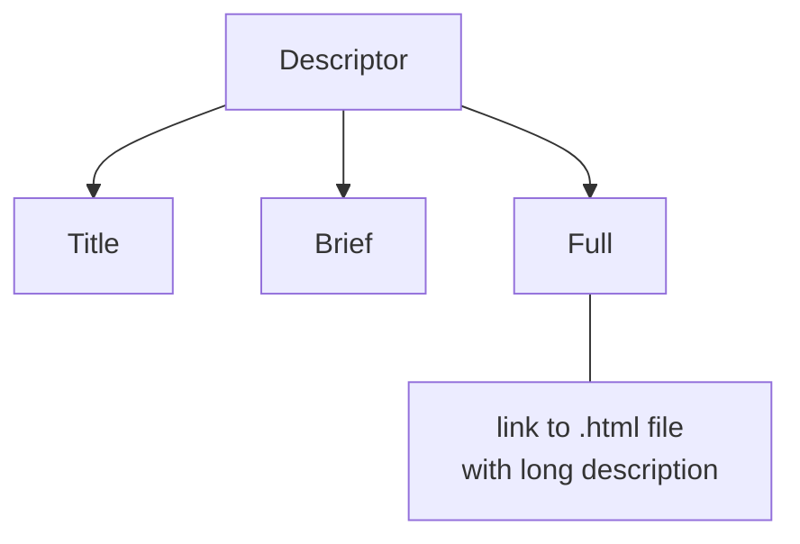
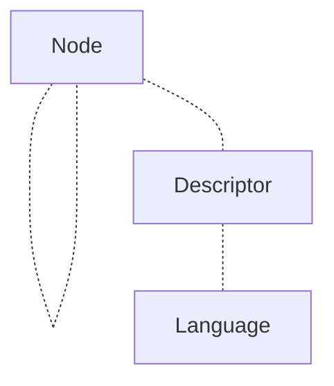
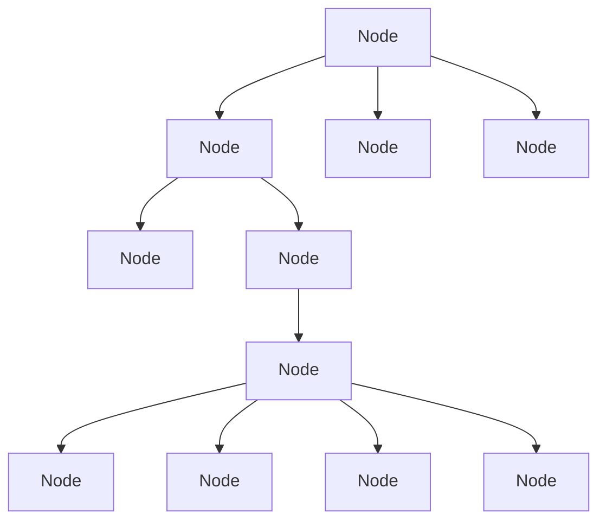
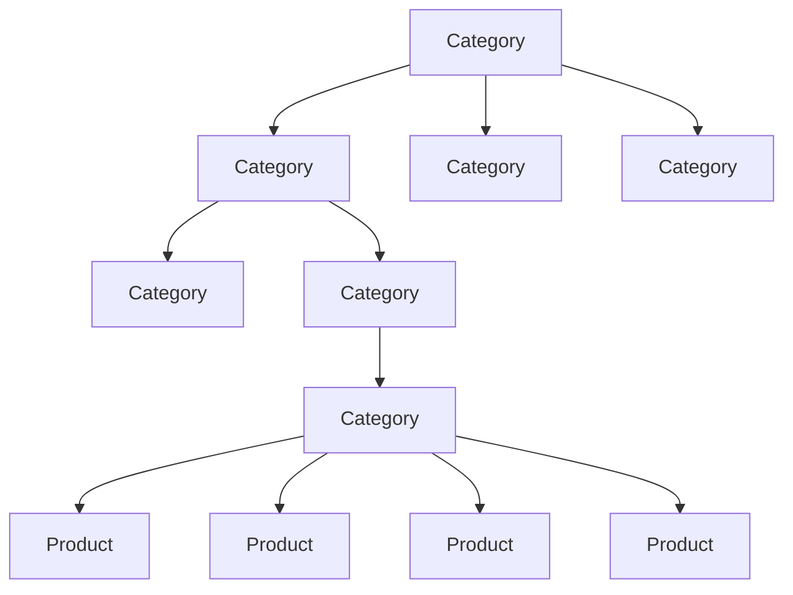

## Kofe Simple Engine / Kalba Engine

This code is a demo fragment of an e-shop full-stack prototype engine that
was developed for Kalba Lab startup. The prototype is designed for developing
a customizable multilingual web shop, allowing administrators without programming
knowledge to manage system languages, product and category descriptions,
and UI text elements in various languages.

The prototype was developed using Java Spring Boot and Angular. Links to demo: 
<li><a href="https://kalbaengine.shop/">shop prototype (kalbaengine.shop)</a></li>
<li><a href="https://kalbaengine.services/">admin panel prototype (kalbaengine.services)</a></li>

## Base conceptions

<b>Descriptors</b>  
The engine operates on a fundamental concept of descriptors.
Each <i>node</i> (which can be either a "category" or a "product") is associated with
a specific set of descriptors.
A crucial rule is followed, which states that there must be one descriptor for each language.

For example, if the system has three languages, Lithuanian, English, and German,
a product like "Book" will have three descriptors providing information in each
of the three languages. When an administrator adds a new language,
the engine automatically expands all descriptors to include the new language.

Each descriptor contains three information fields: a title, a brief description,
and a full description (a link to the .html file with "full" description).

<b>Node</b>  
<i>Node</i> is a data "carrier" that forms a hierarchical system similar to a file system.

<i>Node</i> can be interpreted as a "category" or as a "product".

